# 🕸️💀 Remnawave 面板 × Nginx × SSL · 冥婚级一键部署 🧟‍♂️

> 💘 宝，你知道你和 443 端口的区别吗？443 对全世界开放，而你，只跟我一个人握手。🤝☠️

<p align="center">🦇 ️ 🕸️  💀 🧟‍♀️ ⚰️ 🧛‍♂️ 🌑 🕯️ 🩸 🪦 🎃 ☠️</p>

---

## 🌑 中文文档

### 🎯 它能干嘛

EC2 Ubuntu 一键部署 Remnawave 面板；Nginx 在 443 上做 stream 分流；SSL 自动签发、自动续期。之后在面板 UI 里接入节点，搭好你自己的加密小隧道。🕳️🐍

>  我对你的爱就像 `ssl_preread`：只偷看你一眼握手，绝不解密你的秘密。👁️

### 📥 使用

```bash
chmod +x remnawave-server.sh
sudo ./remnawave-server.sh
```

依次输入：

1. 🏷️ 面板域名（必填）
2. 💌 订阅域名（回车 = 与面板同域名）
3. 📮 SSL 邮箱（必填）
4. 🧟 若检测到旧安装，输入 `yes` 清理后重装

本脚本只装面板。节点全部在面板 UI 里配置，安装阶段不需要节点域名。👻

### 🧱 AWS 安全组

| 端口 | 状态 | 说明 |
|---|---|---|
| TCP 80 | 必开 🔥 | ACME HTTP-01 校验 + 301 跳转 |
| TCP 443 | 必开 💀 | 一切流量的大门 |
| TCP 8443 | 建议开 🕯️ | 便于排查；证书校验流量实际从 443 转入 |

### 🕳️ 端口架构

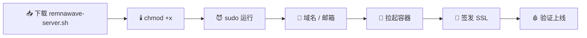

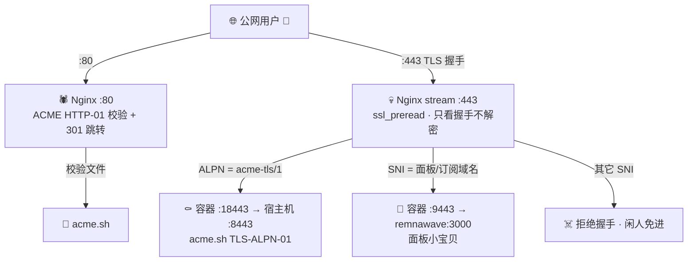

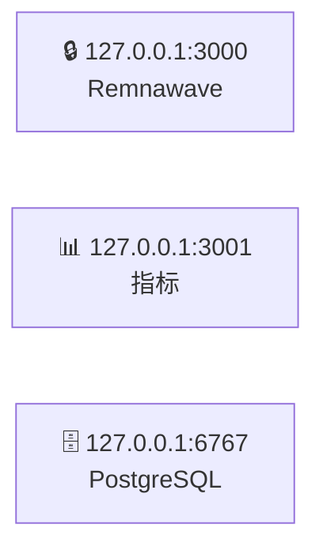

> 💘 宝，我今天去输液了。输的什么液？想你的夜，和只绑 127.0.0.1 的决绝。🌚

Let's Encrypt 的 TLS-ALPN-01 只连 443，所以由 stream 层按 ALPN 把校验流量转到 8443。节点同样要占 443，靠 SNI 与面板分开，互不干扰。🦇

###  证书

- ️ 签发：主用 TLS-ALPN-01（`--alpn --tlsport 8443`），失败自动回退 HTTP-01 webroot（80 端口）
- 🎃 CA：Let's Encrypt
- ⚰️ 位置：
  - `/opt/remnawave/nginx/certs/fullchain.pem`
  - `/opt/remnawave/nginx/certs/privkey.key`
  - 后端容器内：`/var/lib/remnawave/configs/xray/ssl/`
- 🧟‍♀️ 续期：acme.sh cron 自动续期，完成后热重载 Nginx，不停机

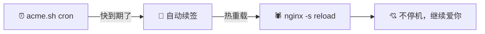

安装完会打印签发者、有效期、覆盖域名，并逐个核对每个域名是否在证书 SAN 内；若装上的仍是引导用的自签证书，脚本直接报错退出。😱

手动查看：

```bash
/root/.acme.sh/acme.sh --list
openssl x509 -in /opt/remnawave/nginx/certs/fullchain.pem -noout -dates -issuer
```

> ⚰️ 他们说证书 90 天就过期，可我对你的爱，自动续期，永不停机。

### ✅ 装完验证三连

```bash
docker network inspect remnawave-network
docker ps
ss -lntp | grep -E ':(80|443)\s'
```

👁️ 三条都正常 = 冥婚已成，面板已上线。

### 🧟 接入节点

节点不在安装脚本里配置，全部在面板 UI 完成：

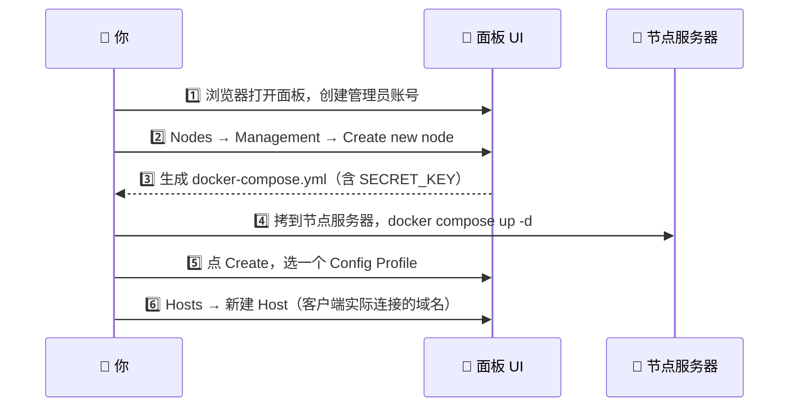

1. 🧑‍️ 浏览器打开面板，创建管理员账号
2. 🕳️ Nodes → Management → Create new node
   - Country / Internal name / Address / Port（默认 2222）
   - Address = 节点服务器的 IP 或域名
   - Port = 面板与节点之间的内部 API 端口，只对面板 IP 放行 🔐
3. 📜 面板生成 docker-compose.yml，拷到节点服务器：

```bash
mkdir -p /opt/remnanode && cd /opt/remnanode
nano docker-compose.yml     # 粘贴面板给的内容（含 SECRET_KEY）
docker compose up -d
```

4. 🩸 回面板点 Create，选一个 Config Profile
5. 🏷️ Hosts → 新建 Host
   - Address = 客户端实际连接的域名（这才是俗称的「节点域名」）
   - SNI = 可选，覆盖 Inbound 里的 serverNames

Address 里的域名解析到节点服务器的 IP，和面板域名没有关系。🌑

#### 🏚️ 节点在另一台机器

本机不用做任何改动。😴

#### 🏠 节点和面板同一台机器（共用 443）

额外三步：

**a)** 🕸️ 把节点域名解析到本机公网 IP

**b)** 🎃 走 TLS（非 Reality）时把它签进证书：

```bash
/root/.acme.sh/acme.sh --issue -d <面板域名> -d <节点域名> \
  --alpn --tlsport 8443 --server letsencrypt
```

证书路径 `/opt/remnawave/nginx/certs/`；节点容器里挂到 `/var/lib/remnawave/configs/xray/ssl/`。Reality（self-steal）不用证书，跳过这步。🧛

**c)** 📝 编辑 `/opt/remnawave/nginx/nginx.conf`，在 stream 的 `sni_target`「同机节点在此加行」处加一行，然后 reload：

```
<节点域名>  172.17.0.1:8444;
```

```bash
docker exec remnawave-nginx nginx -t && \
docker exec remnawave-nginx nginx -s reload
```

remnanode 若在 `remnawave-network` 里，直接写 `容器名:端口`。Xray 入站要开 `"acceptProxyProtocol": true`（stream 层带 PROXY 头）。🦂

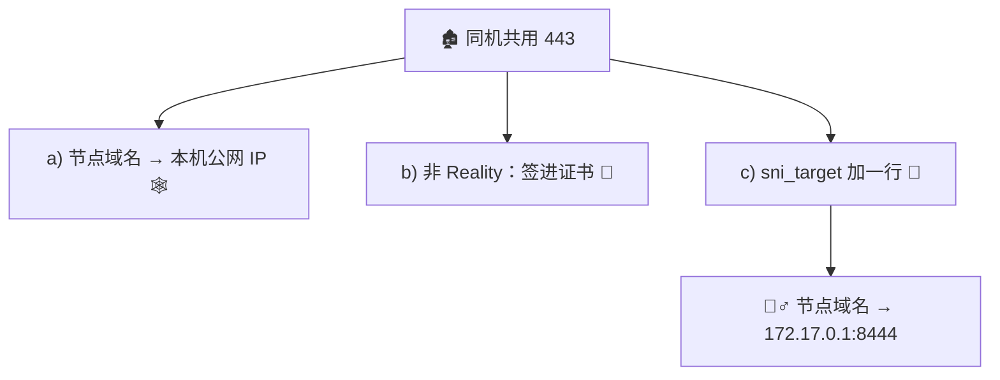

加这一行之前，除面板域名外的所有 SNI 都会被拒绝握手，不会暴露面板。☠️

### 🩺 排查

看 SNI 分流实况（能直接看到每条连接的 sni / alpn / 转发目标）：

```bash
docker logs -f remnawave-nginx | grep sni=
```

数据库拿到的环境变量（`POSTGRES_DB` 必须正好是 `postgres`）：

```bash
docker inspect -f '{{range .Config.Env}}{{println .}}{{end}}' remnawave-db | grep POSTGRES
```

数据库健康检查输出：

```bash
docker inspect -f '{{range .State.Health.Log}}{{.Output}}{{end}}' remnawave-db
```

日志：

```bash
cd /opt/remnawave && docker compose logs -f remnawave
docker logs -f remnawave-nginx
tail -n 100 /root/.acme.sh/acme.sh.log
```

> 🫥 宝，面板不回应你的时候别慌，先看日志。日志就像我的日记，里面全是你。

### ⚰️ 完全卸载

```bash
cd /opt/remnawave && docker compose down -v --remove-orphans; \
cd /opt/remnawave/nginx && docker compose down -v --remove-orphans; \
docker rm -f remnawave remnawave-db remnawave-redis remnawave-nginx; \
docker volume rm -f remnawave-db-data valkey-socket; \
docker network rm remnawave-network; \
rm -rf /opt/remnawave && cd && rm -rf remnawave-server.sh
```

> 💔 卸载可以，删库可以，但删不掉我想你。

---

---

## 🌚 English Docs

### 🎯 What It Does

One-script deployment of the Remnawave panel on EC2 Ubuntu; Nginx steers traffic at the stream layer on 443; SSL is issued and renewed automatically. Nodes are onboarded later from the panel UI to build your own private encrypted tunnel. 🕳️

> 💀 Baby, are you port 443? Because the whole world can knock on it, but you're the only one I'll ever complete a handshake with. 🤝☠️

### 📥 Usage

```bash
chmod +x remnawave-server.sh
sudo ./remnawave-server.sh
```

You will be asked for:

1. 🏷️ Panel domain (required)
2. 💌 Subscription domain (Enter = same as panel)
3. 📮 SSL email (required)
4. 🧟 If an old install is detected, type `yes` to wipe and reinstall

The script installs the panel only. Nodes are configured entirely in the panel UI; no node domain is needed at install time. 👻

### 🧱 AWS Security Groups

| Port | Status | Purpose |
|---|---|---|
| TCP 80 | Required 🔥 | ACME HTTP-01 challenge + 301 redirect |
| TCP 443 | Required 💀 | The one and only gate |
| TCP 8443 | Recommended 🕯️ | Easier debugging; validation traffic actually enters via 443 |

### 🕳️ Port Architecture

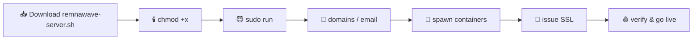

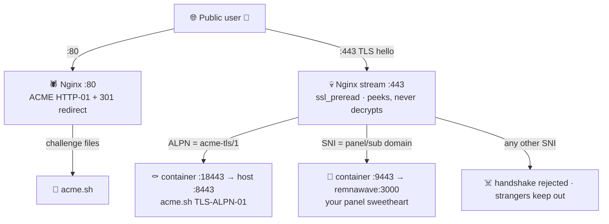

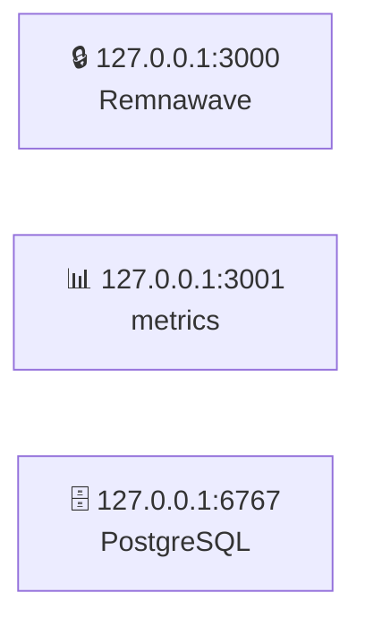

> 🫀 My love for you is like `ssl_preread`: I only peek at your hello, I never decrypt your secrets. 👁️

Let's Encrypt TLS-ALPN-01 only dials 443, so the stream layer routes validation traffic to 8443 by ALPN. Nodes also want 443 — SNI keeps them separated from the panel, no fighting. 🦇

### 📜 Certificates

- 🕯️ Issuance: TLS-ALPN-01 first (`--alpn --tlsport 8443`), automatic fallback to HTTP-01 webroot (port 80)
- 🎃 CA: Let's Encrypt
- ⚰️ Locations:
  - `/opt/remnawave/nginx/certs/fullchain.pem`
  - `/opt/remnawave/nginx/certs/privkey.key`
  - Inside the backend container: `/var/lib/remnawave/configs/xray/ssl/`
- 🧟‍♀️ Renewal: acme.sh cron renews automatically, then hot-reloads Nginx — zero downtime

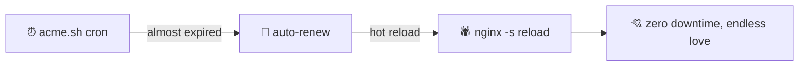

After install, the script prints issuer, validity and covered domains, and checks every domain against the certificate SAN; if a bootstrap self-signed cert is still in place, it exits with an error. 😱

Manual inspection:

```bash
/root/.acme.sh/acme.sh --list
openssl x509 -in /opt/remnawave/nginx/certs/fullchain.pem -noout -dates -issuer
```

> ⚰️ Certificates expire in 90 days. My love for you auto-renews forever.

### ✅ Post-Install Verification Trio

```bash
docker network inspect remnawave-network
docker ps
ss -lntp | grep -E ':(80|443)\s'
```

👁️ All three look good = the séance succeeded, your panel is alive.

### 🧟 Onboarding Nodes

Nodes are not configured by the installer — everything happens in the panel UI:

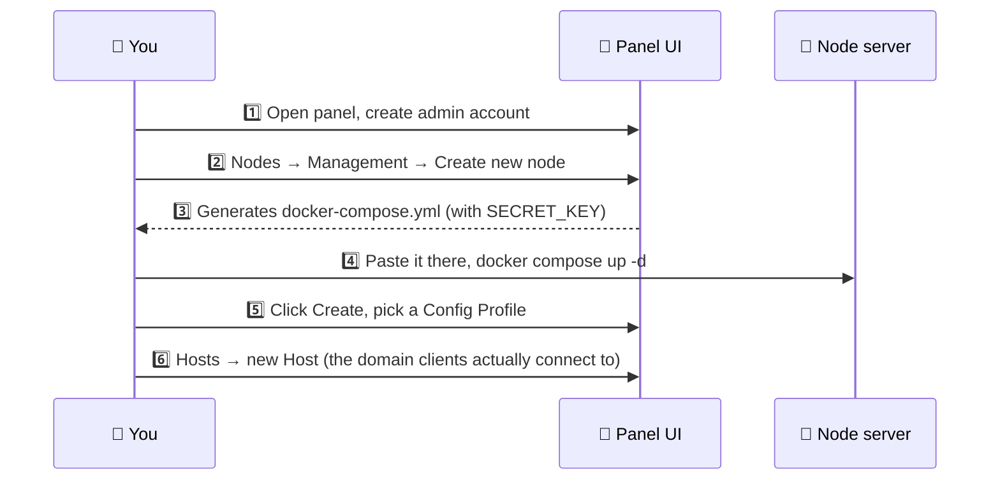

1. 🧑‍⚰️ Open the panel in a browser, create the admin account
2. 🕳️ Nodes → Management → Create new node
   - Country / Internal name / Address / Port (default 2222)
   - Address = the node server's IP or domain
   - Port = internal API port between panel and node, allow the panel IP only 🔐
3. 📜 The panel generates a docker-compose.yml; copy it to the node server:

```bash
mkdir -p /opt/remnanode && cd /opt/remnanode
nano docker-compose.yml     # paste what the panel gave you (contains SECRET_KEY)
docker compose up -d
```

4. 🩸 Back in the panel click Create, pick a Config Profile
5. 🏷️ Hosts → new Host
   - Address = the domain clients actually connect to (the so-called "node domain")
   - SNI = optional, overrides serverNames in the Inbound

The domain in Address resolves to the node server's IP — it has nothing to do with the panel domain. 🌑

#### 🏚️ Node on another machine

Nothing to change on this machine. 😴

####  Node on the same machine (sharing 443)

Three extra steps:

**a)** 🕸️ Point the node domain at this machine's public IP

**b)** 🎃 For TLS (non-Reality), add it to the certificate:

```bash
/root/.acme.sh/acme.sh --issue -d <panel-domain> -d <node-domain> \
  --alpn --tlsport 8443 --server letsencrypt
```

Cert lives in `/opt/remnawave/nginx/certs/`; mount it into the node container at `/var/lib/remnawave/configs/xray/ssl/`. Reality (self-steal) needs no certificate — skip this. 🧛

**c)** 📝 Edit `/opt/remnawave/nginx/nginx.conf`, add one line under `sni_target` where it says "same-machine nodes add a line here", then reload:

```
<node-domain>  172.17.0.1:8444;
```

```bash
docker exec remnawave-nginx nginx -t && \
docker exec remnawave-nginx nginx -s reload
```

If remnanode sits inside `remnawave-network`, just write `container-name:port`. The Xray inbound needs `"acceptProxyProtocol": true` (the stream layer sends a PROXY header). 🦂

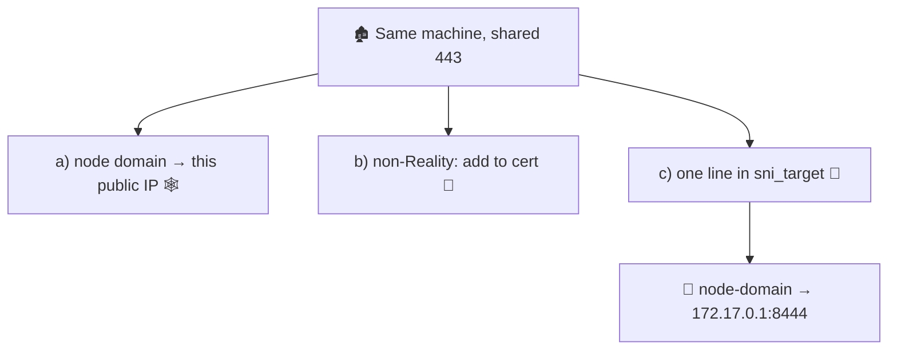

Until you add that line, every SNI except the panel domains gets its handshake rejected — the panel stays hidden. ☠️

### 🩺 Troubleshooting

Watch the SNI steering live (see sni / alpn / forward target per connection):

```bash
docker logs -f remnawave-nginx | grep sni=
```

Env vars as seen by the database (`POSTGRES_DB` must be exactly `postgres`):

```bash
docker inspect -f '{{range .Config.Env}}{{println .}}{{end}}' remnawave-db | grep POSTGRES
```

Database healthcheck output:

```bash
docker inspect -f '{{range .State.Health.Log}}{{.Output}}{{end}}' remnawave-db
```

Logs:

```bash
cd /opt/remnawave && docker compose logs -f remnawave
docker logs -f remnawave-nginx
tail -n 100 /root/.acme.sh/acme.sh.log
```

> 🫥 Don't panic when the panel goes silent, baby — read the logs. Logs are my diary, and every line is about you.

### ⚰️ Full Uninstall

```bash
cd /opt/remnawave && docker compose down -v --remove-orphans; \
cd /opt/remnawave/nginx && docker compose down -v --remove-orphans; \
docker rm -f remnawave remnawave-db remnawave-redis remnawave-nginx; \
docker volume rm -f remnawave-db-data valkey-socket; \
docker network rm remnawave-network; \
rm -rf /opt/remnawave && cd && rm -rf remnawave-server.sh
```

> 💔 You may uninstall everything, you may drop every database — but you cannot delete me missing you.

<p align="center">🪦 🕯️ 愿你的流量永远加密，愿你的握手永不超时 🕯️ </p>

## 🧟‍♂️ 启停冥咒 (Start & Stop Spells)

> 💀 宝，启动顺序绝对不能反。Nginx 是个死心眼的鬼，启动时非要找 `remnawave:3000` 结阴亲。后端要是没先爬起来，Nginx 就会当场暴毙给你看。🩸 **我连死，都要排在你后面。**

### 🕯️ 唤醒 (Start)
先叫醒后端，再唤醒 Nginx。

```bash
cd /opt/remnawave       && docker compose up -d
cd /opt/remnawave/nginx && docker compose up -d
```

### ⚰️ 入土 (Stop)
先让 Nginx 闭眼，再让后端咽气。

```bash
cd /opt/remnawave/nginx && docker compose down
cd /opt/remnawave       && docker compose down
```

### 🧟‍♀️ 诈尸 (Restart)

```bash
cd /opt/remnawave && docker compose restart
```

*👻 如果只改了 `nginx.conf`，别折腾尸体，直接热重载：*
```bash
docker exec remnawave-nginx nginx -s reload
```

### 👁️ 窥视 (Status / Logs)

```bash
docker ps
cd /opt/remnawave && docker compose logs -f remnawave
docker logs -f remnawave-nginx
```

> 🕸️ 别怕服务器断电，所有容器都刻了 `restart: always` 的复活符文。只要服务器一通电，它们就会自动从坟墓里爬出来找你。🦇

---

## 🧛‍♂️ English Docs

> 💀 Baby, the startup order must never be reversed. Nginx is a stubborn ghost that insists on marrying `remnawave:3000` upon startup. If the backend hasn't risen from the grave first, Nginx will die on the spot. 🩸 **Even in death, I must follow behind you.**

### 🕯️ Awakening (Start)
Wake the backend first, then summon Nginx.

```bash
cd /opt/remnawave       && docker compose up -d
cd /opt/remnawave/nginx && docker compose up -d
```

### ⚰️ Burial (Stop)
Close Nginx's eyes first, then let the backend rest in peace.

```bash
cd /opt/remnawave/nginx && docker compose down
cd /opt/remnawave       && docker compose down
```

### 🧟‍♀️ Reanimation (Restart)

```bash
cd /opt/remnawave && docker compose restart
```

*👻 If you only tweaked `nginx.conf`, don't disturb the corpse, just hot-reload:*
```bash
docker exec remnawave-nginx nginx -s reload
```

### 👁️ Peeping (Status / Logs)

```bash
docker ps
cd /opt/remnawave && docker compose logs -f remnawave
docker logs -f remnawave-nginx
```

> 🕸️ Don't fear power outages. Every container is carved with the `restart: always` resurrection rune. As long as the server gets power, they will automatically crawl out of their graves to find you. 🦇
